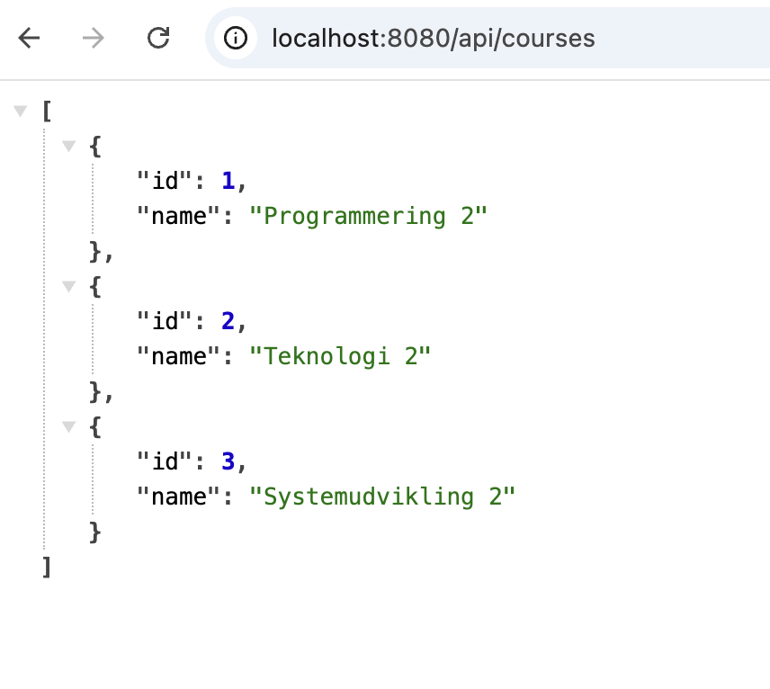

# Spring Data JPA Intro

## Objectives

* WRITE SOMETHING HERE


Literature used:

* Spring boot in action, 2024

## Intro to Spring Data JPA

Spring Data JPA is part of the Spring Data framework ([https://spring.io/projects/spring-data](https://spring.io/projects/spring-data)) an umbrella project designed to simplify data access in Spring-based applications. Its main goal is to reduce boilerplate code and provide a consistent programming model across different types of data stores, such as relational databases (e.g., MySQL, PostgreSQL).

**Spring Data JPA** focuses specifically on integrating the **Jakarta Persistence API (JPA)** with the Spring ecosystem. While JPA itself is just a set of interfaces for object-relational mapping (ORM), Spring Data JPA builds on top of a JPA provider like **Hibernate**, which supplies the actual implementation

## Why use Spring Data JPA?

Spring Data JPA streamlines working with relational databases in Java by:

* **Reducing boilerplate**: Eliminates the need to write common CRUD operations.
* **Providing a unified API**: Offers the same repository-based interface regardless of the underlying database.
* **Encouraging best practices**: Promotes separation of concerns and a clean architecture.
* **Enabling rapid development**: Developers can focus on business logic rather than repetitive data access code.

In essence, Spring Data JPA acts as a bridge between Java objects and the underlying relational database, enabling developers to interact with their database using standard Java code and minimal configuration.

## Configuring Spring Data JPA

In the following you are shown configurations for connecting to two different relational databases:

* H2 database: An in memory database, with&#x20;
* MySQL database:

In many projects we are going to use both databases, the H2 for testing purposes, and the MySQL database for the actual production database.

### Using an in-memory database (H2)

To configure a relational database, you need to add two additional dependencies in

In order to use Spring Data JPA with H2 in an existing project, you need to add two additional dependencies to the `pom.xml` file:


```xml
<dependency>
    <groupId>org.springframework.boot</groupId>
    <artifactId>spring-boot-starter-data-jpa</artifactId>
</dependency>
<dependency>
    <groupId>com.h2database</groupId>
    <artifactId>h2</artifactId>
    <scope>runtime</scope>
</dependency>
```


Every spring boot project contains a `application.properties` file, in which you can configure variuous properties for your application. To configure the H2 database, add the following:


```properties
# H2 in-memory database configuration
spring.datasource.url=jdbc:h2:mem:testdb
spring.datasource.driverClassName=org.h2.Driver
spring.datasource.username=sa
spring.datasource.password= 
spring.h2.console.enabled=true
spring.h2.console.path=/h2-console
```


This is everything that is needed for the connection to be established.

#### Verify the database connection

To verify the database connection, add the following to the existing test class:

```java
@SpringBootTest
class JpaApplicationTests {

    @Autowired
    private DataSource dataSource;

    @Test
    public void whenConnectingToDatabase_thenDatabaseIsAccessible() throws SQLException {
        try (Connection connection = dataSource.getConnection()) {
            String dbName = connection.getMetaData().getDatabaseProductName();
            assertThat(dbName).isNotNull();
            assertThat(dbName).isEqualTo("H2");
            System.out.println("Connected to: " + dbName);
        }
    }
}
```


The `@SpringBootTest` annotation tells Spring Boot to start the **full application context**, similar to how it would run in production. This is necessary to autowire beans like `DataSource`.

Without `@SpringBootTest`, Spring wouldn't initialize the context, and the `@Autowired` `dataSource` would be `null`.


**Run the test!** If configured properly it should pass the test, and print the message:

```bash
Connected to: H2
```


### Configuring a relational database (MySQL)

#### Prerequisites

To follow along, make sure you have **MySQL** installed (in addition MySQL Workbench or DataGrip).

You can verify that you have MySQL, by running the following command in a terminal:

```bash
mysql --version
```

This should output the MySQL version (if installed).

#### Create a new database

Create a new database called `jpatest` in your preffered way. It can be done by using the terminal:

```bash
mysql -u {{your username}} -p
```

It prompts you for your password - type it, and press enter.

Create the database by running (remember the trailing semicolon):

```sql
CREATE DATABASE jpatest;
```

#### Configuration

With this out of the way, we need to add the MySQL driver dependency to our `pom.xml`:


```xml
<dependency>
    <groupId>com.mysql</groupId>
    <artifactId>mysql-connector-j</artifactId>
    <scope>runtime</scope>
</dependency>
```


In our application.properties file replace the content, with the following:&#x20;

```properties
# H2 in-memory database configuration
#spring.datasource.url=jdbc:h2:mem:testdb
#spring.datasource.driverClassName=org.h2.Driver
#spring.datasource.username=sa
#spring.datasource.password=
#spring.h2.console.enabled=true
#spring.h2.console.path=/h2-console

# MySQL configuration
spring.datasource.url=jdbc:mysql://localhost:3306/jpatest
spring.datasource.username= #Enter your username
spring.datasource.password= #Enter your password
```

#### Verify the database connection

Run the same test as before. The test should fail, and the reason is that it still expects the `dbName` to be `H2` - fix it by replacing it with `MySQL`.

If the test still fails, make sure that your username and password are correct!


## Managing domain objects with Spring Data JPA <a href="#heading_id_11" id="heading_id_11"></a>

We will explore how to manage business domain objects in a relational database with Spring Data JPA:

Start by creating a POJO (Plain Old Java Object):


```java
public class Course {
    private Long id;
    private String name;
}
```


We want this class to correspond to the following sql table:

```sql
CREATE TABLE course (
    id BIGINT PRIMARY KEY,
    name VARCHAR(255)
);
```

To map the `Course` class to this SQL table using Spring Data JPA, we annotate it with JPA annotations and mark it as an entity:


```java
@Entity
public class Course {
    @Id
    private Long id;
    private String name;
    
    // Getters & Setters is omitted here
}
```


#### What This Does

* `@Entity`: Tells JPA that this class represents a table in the database.
* `@Id`: Marks `id` as the primary key of the table.
* JPA automatically maps the fields `id` and `name` to corresponding columns.

To allow Hibernate (the JPA provider) to create the necessary database tables at application startup, add the following line to your `application.properties` file:


```properties
spring.jpa.hibernate.ddl-auto=create
```



`ddl-auto` strategies:

There exist different `ddl-auto` strategies that impact how the database schema is managed by Spring Data  JPA at runtime:

* **`update`**:  Updates the schema to match the entity definitions without removing existing data.
* **`create`**: Drops existing tables, recreates them based on current mappings.
* **`create-drop`:** Creates the schema at startup, drops it on shutdown.
* **`none`**: No changes to the schema.&#x20;


#### Run the application

By running the application, JPA/Hibernate will:

* Connect to  database.
* Generate the corresponding table ( `course`) based on your entity class.

#### Verify that the table is created

Add the following test to the test class:

```java
    @Autowired
    private JdbcTemplate jdbcTemplate;

    @Test
    public void whenCheckingCoursesTable_thenItExists() {
        Integer count = jdbcTemplate.queryForObject("SELECT COUNT(*) FROM course", Integer.class);
        assertThat(count).isNotNull(); // No exception = table exists
    }
```


### Id generation in JPA

In relational databases, it’s common to have the **primary key (`id`) auto-generated**. Spring Data JPA makes this easy with the `@GeneratedValue` annotation.

Update your `Course` entity like this:


```java
import jakarta.persistence.*;

@Entity
public class Course {

    @Id
    @GeneratedValue(strategy = GenerationType.IDENTITY)
    private Long id;
    private String name;

    // Getters and setters...
}

```



There exists different `GenerationType`'s for `@GeneratedValue` see [https://www.baeldung.com/hibernate-identifiers#generated-identifiers](https://www.baeldung.com/hibernate-identifiers#generated-identifiers)


This corresponds to the following SQL statement (notice the `AUTO_INCREMENT`):

```sql
CREATE TABLE course (
    id BIGINT PRIMARY KEY AUTO_INCREMENT,
    name VARCHAR(255)
);
```


## Adding a repository layer

Spring Data JPA provides powerful abstractions for interacting with the database. This means developers can focus on writing business logic without having to write boilerplate code for data access (such as SQL queries, connection handling, and result mapping).

To retrieve data using Spring Data JPA, you typically create a **repository interface** that extends one of Spring Data's base interfaces.


```java
import org.springframework.data.jpa.repository.JpaRepository;

public interface CourseRepository extends JpaRepository<Course, Long> {
}

```


And thats everything we need to access the database. Spring will automatically generate the implementation for this interface at runtime. It provides a full set of CRUD operations out of the box:

* `save()`
* `findById()`
* `findAll()`
* `deleteById()`

You don’t have to write any SQL or implementation code — just define the interface (as above), and Spring Data JPA provides an implementation automatically.

#### Testing save functionality

Add the following test to the test class:

```java
@Autowired
private CourseRepository courseRepository;

@Test
public void whenSavingCourse_thenItShouldBeFoundById() {
    // Arrange
    Course course = new Course();
    course.setName("Spring Data JPA");

    // Act
    courseRepository.save(course);
    Optional<Course> retrieved = courseRepository.findById(1L);

    // Assert
    assertThat(retrieved).isPresent();
    assertThat(retrieved.get().getName()).isEqualTo("Spring Data JPA");
}
```


### Communicating with the repository layer

Typically you do not communicate directly with the repository layer. There should be a service layer that acts as a bridge between the controller layer and repository layer


```java
@Service
public class CourseService {
    private final CourseRepository courseRepository;
    
    public CourseService(CourseRepository courseRepository) {
        this.courseRepository = courseRepository;
    }
    
    public List<Course> findAll() {
        return courseRepository.findAll();
    }
    
    // Other CRUD methods...
}
```


TODO!!!

The controller layer handles outside communication to the application, for our purpose we create a RESTful endpoint:

```java
@RestController
@RequestMapping("/api/courses")
public class CourseController {
    private final CourseService courseService;
    
    public CourseController(CourseService courseService) {
        this.courseService = courseService;
    }
    
    @GetMapping
    public ResponseEntity<List<Course>> getAllCourses() {
        return ResponseEntity.ok(courseService.findAll());
    }
    
    // Other CRUD methods...
}
```


## Initializing the database with data&#x20;

It’s often useful to preload the database with some sample data. We will show two common approaches:

1. **Using a `data.sql` file**
2. **Using a custom `InitData` class**

### Using a `data.sql` file

Start by creating a `data.sql` in the `src/main/resources` folder, and add the following insert statements:


```sql
INSERT INTO course (name) VALUES 
('Programmering 2'),
('Teknologi 2'),
('Systemudvikling 2');
```


In order for Spring Data JPA to initialize the database with the data, we need to configure it in `application.properties` file:


```properties
# H2 in-memory database configuration
#spring.datasource.url=jdbc:h2:mem:testdb
#spring.datasource.driverClassName=org.h2.Driver
#spring.datasource.username=sa
#spring.datasource.password=
#spring.h2.console.enabled=true
#spring.h2.console.path=/h2-console

# MySQL configuration
spring.datasource.url=jdbc:mysql://localhost:3306/jpatest
spring.datasource.username= #Enter your username
spring.datasource.password= #Enter your password

spring.jpa.hibernate.ddl-auto=create
spring.jpa.defer-datasource-initialization=true
spring.sql.init.mode=always
```


#### Verify the data initialization

TODO: Write a test for


### Using an InitData class

Spring Boot offers an interface `CommandLineRunner` that allows you to run custom code after the application has fully started — right after the Spring context is loaded.

The interface only has one method, that we need to implement - `run()`:


```java
@Configuration
public class InitData implements CommandLineRunner {

    private final CourseRepository courseRepository;

    public InitData(CourseRepository courseRepository) {
        this.courseRepository = courseRepository;
    }

    @Override
    public void run(String... args) throws Exception {
        Course course1 = new Course();
        course1.setName("Programmering 2");
        Course course2 = new Course();
        course2.setName("Teknologi 2");
        Course course3 = new Course();
        course3.setName("Systemudvikling 2");

        courseRepository.saveAll(List.of(course1, course2, course3));
    }
}
```


By using `@Configuration` we make sure that it is a spring managed bean - ie. Spring is automatically creating an instance of the InitData class. Since `InitData` implements `CommandLineRunner,` Spring detects this, and will automatically call the `run()` method once the application is fully initialized.

#### Verify that the courses are created&#x20;

TODO: WRITE TEST FOR THIS


## Testing the course API

The controller at this point exposes one endpoint: **GET** **`http://localhost:8080/api/courses`**. Run the Application and verify that the endpoint is available:

<figure><figcaption></figcaption></figure>


***

## Peer instructions:

**1. What does the `@Entity` annotation do?**

1. Marks a class as a Spring bean
2. Maps the class to a database table
3. Ensures the class has an ID field
4. Registers the class with the repository

**2. Which of these fields must be present in every JPA entity?**

1. A field with `@Column`
2. &#x20;A field with `@GeneratedValue`
3. A field with `@Id`
4. A field named `id`

**3. What does `@GeneratedValue(strategy = GenerationType.IDENTITY)` do?**

1. Manually assigns a value to the ID field
2. Uses a UUID generator
3. Lets the database auto-generate the primary key (e.g., auto-increment)
4. Requires the developer to provide the ID

**4. What happens when you call `.save()` on a Spring Data JPA repository?**

1. It updates the database schema
2. It persists a new entity or updates an existing one based on the ID
3. It always inserts a new record
4. It deletes the entity if it already exists

**5. What does `spring.jpa.hibernate.ddl-auto=update` do?**

1. Drops and recreates all tables every time
2. Does nothing — no schema changes
3. Updates the DB schema based on entities without removing existing data
4. Only validates the schema without changes

**6. Which `ddl-auto` setting should you avoid in production?**

1. `validate`
2. `update`
3. `none`
4. `create-drop`

***

## Exercises:

### 1. Create a full CRUD REST API for `Course`

#### 1.1: Expand functionality of the Course project, to include the following endpoints:

* **GET** `api/courses`&#x20;
* **GET** `api/courses/{id}`
* **POST** `api/courses`
* **PUT** `api/courses/{id}`
* **DELETE** `api/courses/{id}`

Generate some dummy data using `InitData` approach as above.

Make sure to test all endpoints in **Postman**.

#### 1.2: Validation annotations

Add the following new fields to the `Course` entity with validation:

* `String shortName` (like **PROG2** or **TEK2**) - between 3 to 7 characters.
* `String description`
* `int ects` - the value should be positive.

**Hint:** see validation annotations here: [https://www.baeldung.com/java-validation#validation](https://www.baeldung.com/java-validation#validation)

```java
// Example using validation annotations
@Size(min = 3, max = 7, message = "Must be between 3 to 7 characters")
private String shortName;
```

### 2. Add a new entity: `Student`

#### 2.1:  Add a new entity `Student` with the following attributes:

* fullName
* email - Make sure it is a valid email (use validation annotation)
* dateOfBirth - Make sure that the date is in the past (use validation annotation)

#### 2.2:  Create a full CRUD for the `Student` entity

* **GET** `api/students`&#x20;
* **GET** `api/students/{id}`
* **POST** `api/students`
* **PUT** `api/students/{id}`
* **DELETE** `api/students/{id}`

Generate some dummy data using `InitData` approach as above.

Make sure to test all endpoints in **Postman**.


